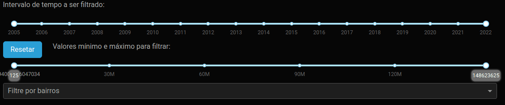
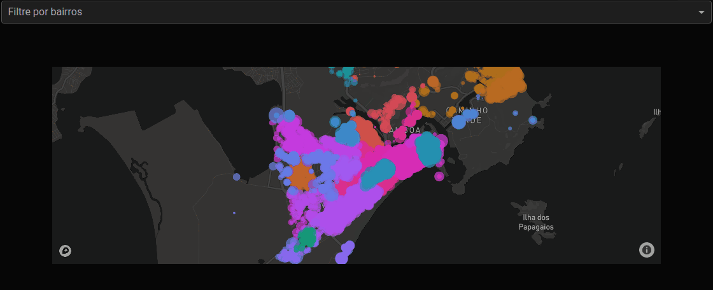

Este projeto consiste em um painel de controle que exibe valores simulados de transações imobiliárias ocorridas na cidade de Cabo Frio.

Você pode acessá-lo diretamente através do seguinte link: [Dash - Cabo Frio](http://odecam.pythonanywhere.com/).

# Executando Localmente
Para executar este projeto em sua máquina local, siga estas etapas:

1. Certifique-se de que todas as dependências listadas no arquivo "Requirements.txt" estão instaladas.
2. Crie um arquivo chamado "mapbox_token" e defina a variável "token" nele.
3. No diretório raiz do projeto, execute o seguinte comando: python app.py.

Caso precise obter um token do Mapbox, você pode obtê-lo [aqui](mapbox.com).

# Destaques do Código
## Barra de Filtro de Valores Dinâmica
Uma das funcionalidades notáveis deste projeto é a barra de filtro de valores, que se adapta dinamicamente para refletir os valores existentes no conjunto de dados filtrados por outros componentes que controlam a figura gerada. Saiba mais.

[Explicação do código](code-explanations/dinamic-slider.md)

## Cores Sincronizadas no Mapa e no Seletor de Bairros
Outro destaque é a sincronização das cores no mapa, que distinguem os bairros, com as cores usadas para a fonte no componente de filtragem de bairros. Saiba mais.

[Explicação do código](code-explanations/bairros-colors.md)

# Próximos Passos
Uma melhoria planejada é ajustar o componente responsável por selecionar o intervalo de valores a serem exibidos para que reflita a distribuição exponencial dos dados de transações. Isso permitirá uma visualização mais precisa da concentração de valores à esquerda da barra. [Saiba mais](https://dash.plotly.com/dash-core-components/rangeslider#:~:text=Non%2DLinear%20Slider%20and%20Updatemode).
